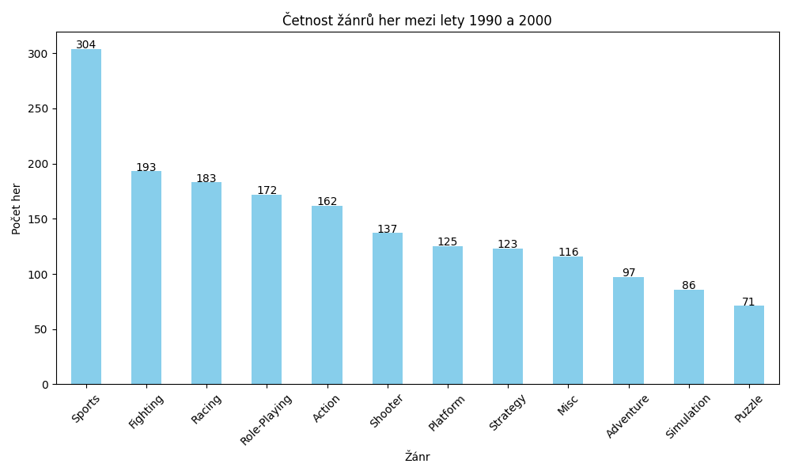
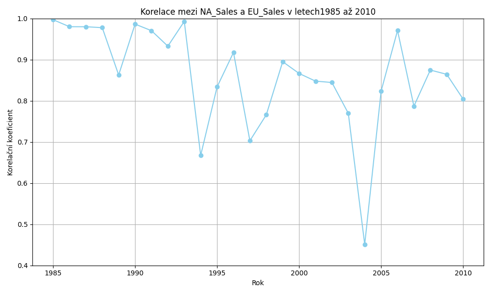
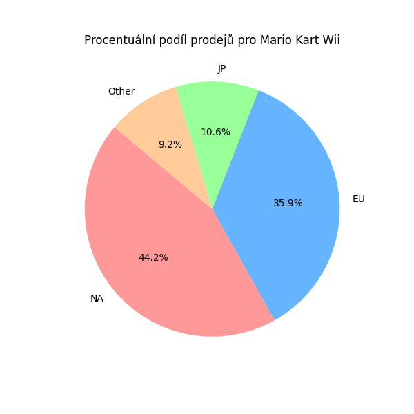
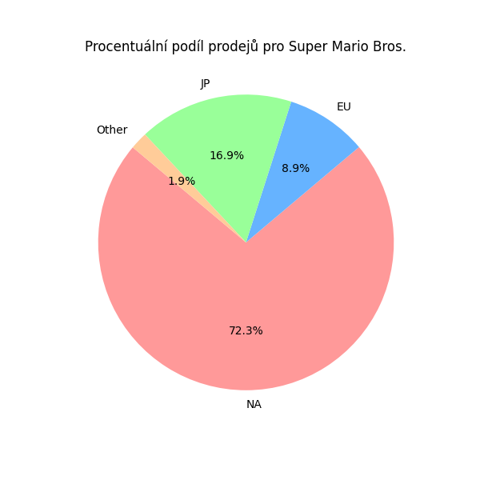
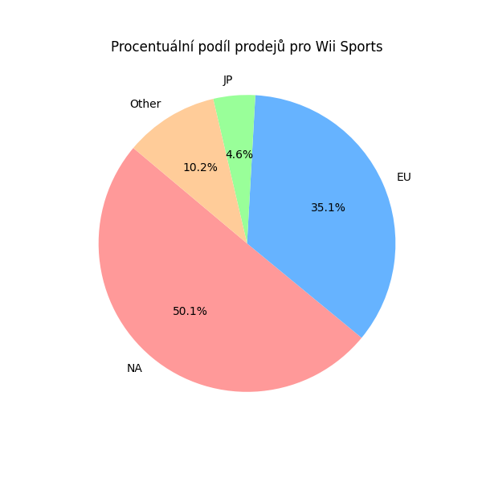
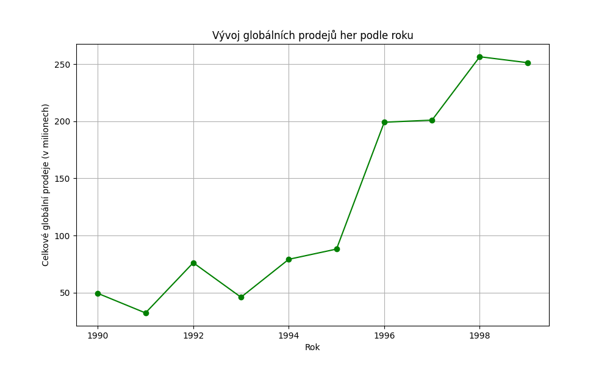
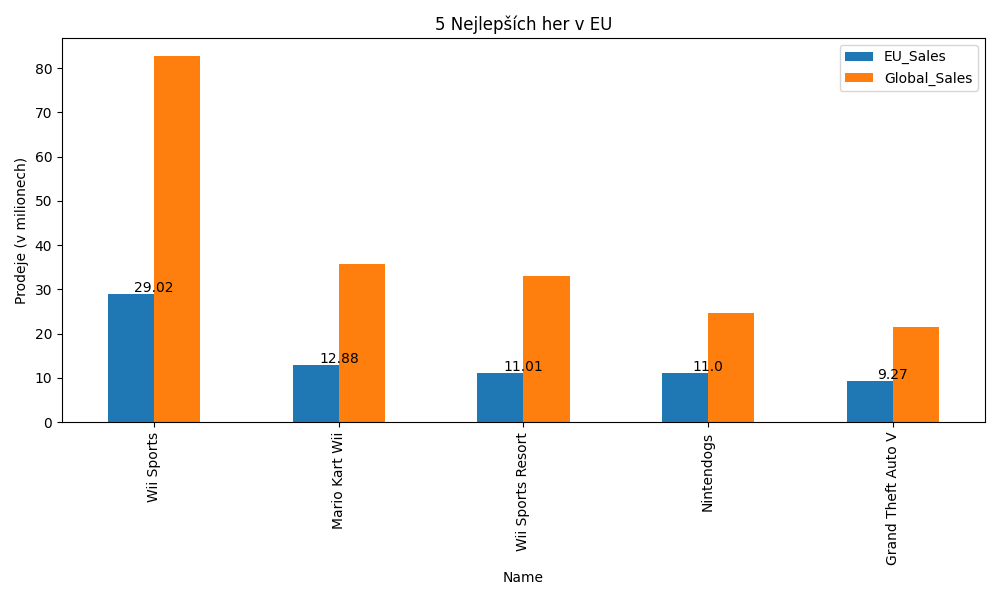
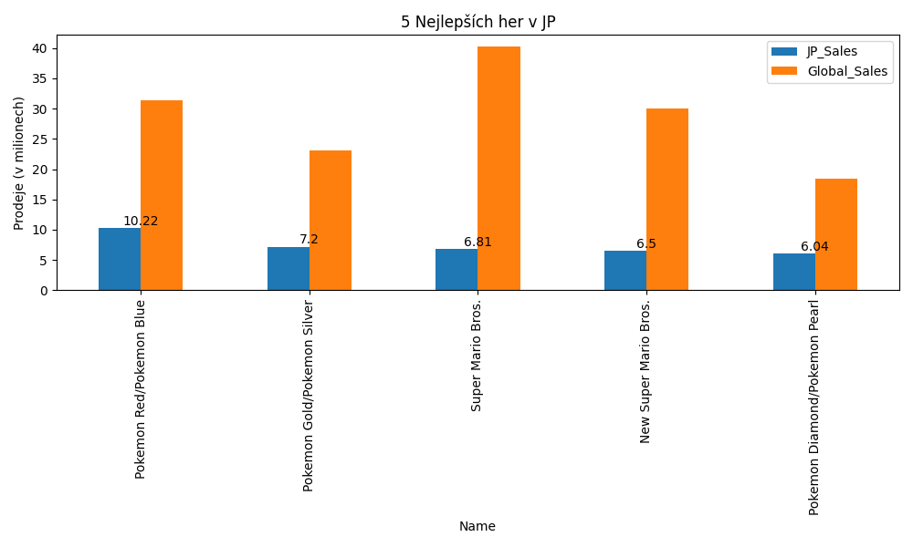
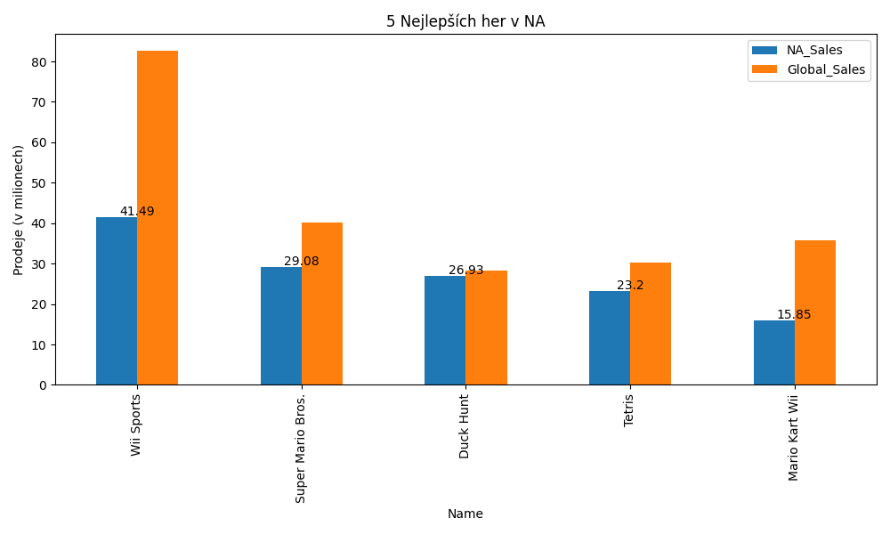

Can be run with:
```python
python src/main.py
```
<p align="center">
Task 1:<br>
  
</p>
<p align="center">
Task 2: <br>
Korelační koeficient mezi NA_Sales a EU_Sales: 0.7677267483702631
</p>
<p align="center">
    Task 3:<br>
  
</p>
<p align="center">
Task 4: <br>
Minimální rozdíl: -4.949999999999999 (Hra: FIFA 16)<br>
Maximální rozdíl: 12.470000000000002 (Hra: Wii Sports)<br>
Průměr: 0.1306479113384484<br>
Směrodatná odchylka: 0.5481568321698492<br>
</p>
<p align="center">
Task 5:<br>
  
    &nbsp; &nbsp; &nbsp; &nbsp;
  
  &nbsp; &nbsp; &nbsp; &nbsp;
  
</p>
<p align="center">
Task 6:<br>
  
</p>
<p align="center">
Task 7:<br>
  
    &nbsp; &nbsp; 
  
  &nbsp; &nbsp; 
  
</p>